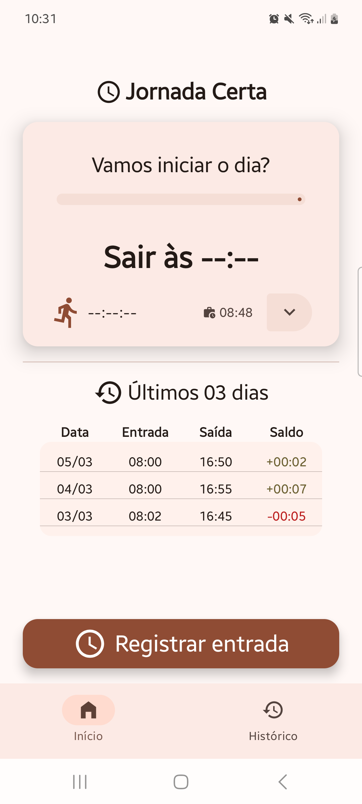
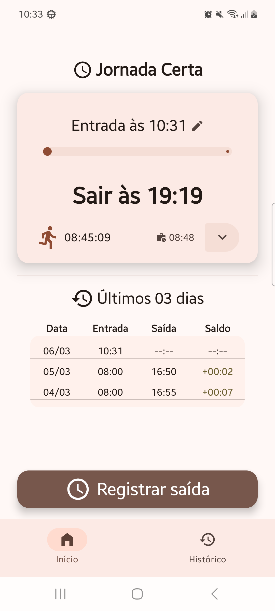
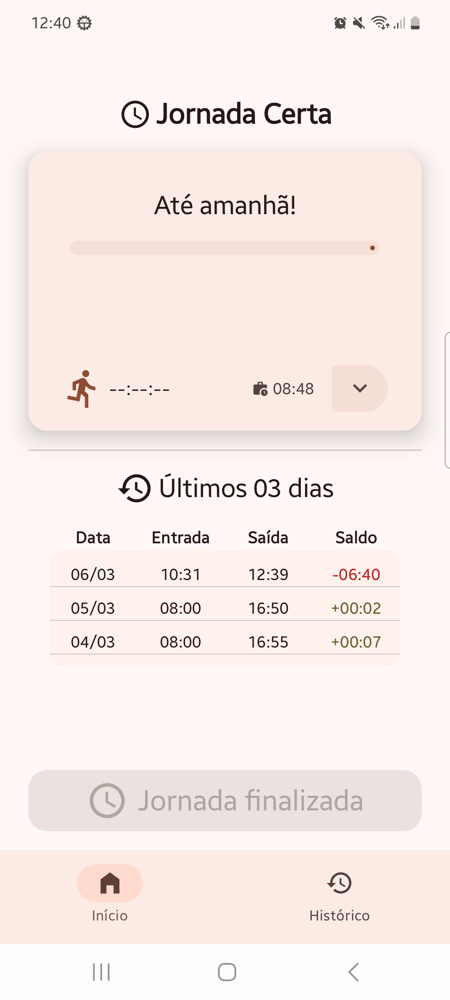
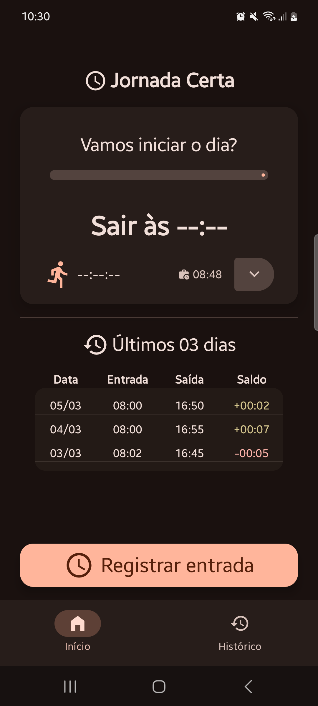
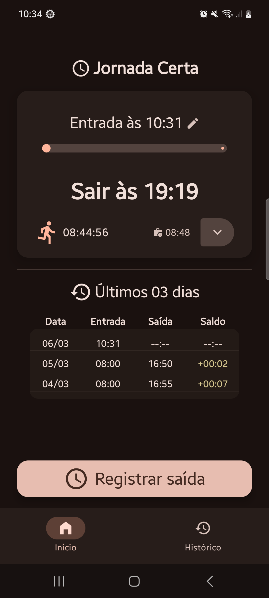
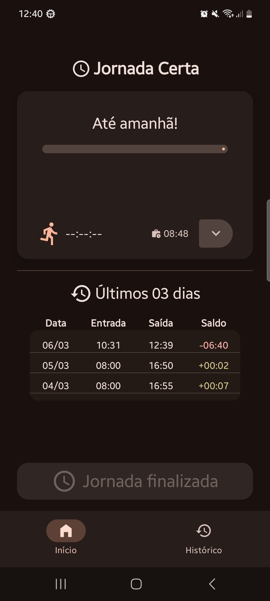

# 🕒 Jornada Certa - Assistente de Ponto Inteligente

O **Jornada Certa** é um aplicativo Android nativo que auxilia no controle da jornada de trabalho. Mais do que um simples registro, o app atua como um assistente preventivo, utilizando notificações agendadas para garantir que o usuário nunca esqueça de bater o ponto.

### 📸 Screenshots

<table width="100%">
  <tr>
    <th colspan="3" align="center">☀️ Light Mode</th>
  </tr>
  <tr>
    <td align="center"></td>
    <td align="center"></td>
    <td align="center"></td>
  </tr>
</table>

  <table width="100%">
  <tr>
    <th colspan="3" align="center">🌙 Dark Mode</th>
  </tr>
  <tr>
    <td align="center"></td>
    <td align="center"></td>
    <td align="center"></td>
  </tr>
</table>

## 🚀 Destaques Técnicos

Este projeto foi construído utilizando as práticas mais modernas do ecossistema Android:

* **Arquitetura MVVM & Clean Architecture:** Separação clara de responsabilidades, facilitando a testabilidade e manutenção.
* **Jetpack Compose:** UI 100% declarativa com Material Design 3, suporte a Dark/Light mode e estados reativos.
* **Injeção de Dependência (Hilt):** Gerenciamento modular de dependências, utilizando `@Binds` para interfaces e `@Provides` para serviços do sistema.
* **Persistência com Room:** Armazenamento local com suporte a Coroutines.
* **Background Tasks (AlarmManager):** Implementação de notificações via `BroadcastReceiver`, garantindo lembretes mesmo com o app fechado.
* **Gestão de Permissões:** Fluxo completo de permissões para Android 13+ (`POST_NOTIFICATIONS`) e tratamento de `SCHEDULE_EXACT_ALARM` para Android 12+.
* **Integração de Bibliotecas de Terceiros:** Uso estratégico da biblioteca `sheets-compose-dialogs` para criar diálogos de seleção e informação altamente customizados e integrados ao Material Design 3, melhorando a experiência do usuário (UX).

## ✨ Funcionalidades

* **Registro de Entrada/Saída:** Fluxo simplificado com persistência imediata.
* **Cálculo Automático:** Estimativa de horário de saída baseada na jornada configurada.
* **Configuração Flexível de Jornada:** Permite que o usuário modifique o horário de entrada e a carga horária diária a qualquer momento.
* **Validação Inteligente:** O sistema impede a inserção de horários inválidos ou logicamente impossíveis, garantindo que o cálculo da saída estimada e as notificações sejam sempre precisos e confiáveis.
* **Validação de Saída Antecipada:** Diálogos informativos para evitar erros de registro antes do cumprimento da carga horária.
* **Sistema de Notificações Duplo:**
    * 🔔 **Lembrete Prévio:** 10 minutos antes do fim da jornada.
    * ⚠️ **Lembrete de Segurança:** 1 hora após a saída estimada para evitar esquecimentos.
 
## 🛠️ Stack Tecnológica

* Kotlin + Coroutines & Flow
* Jetpack Compose + Navigation
* Dagger Hilt
* Room Database
* Material 3 + Sheets-Compose-Dialogs
